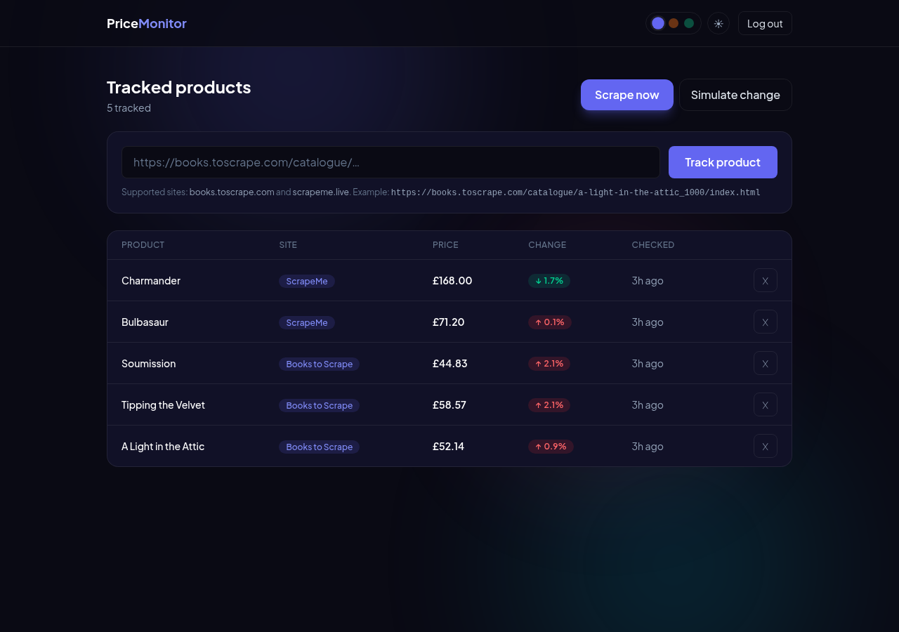
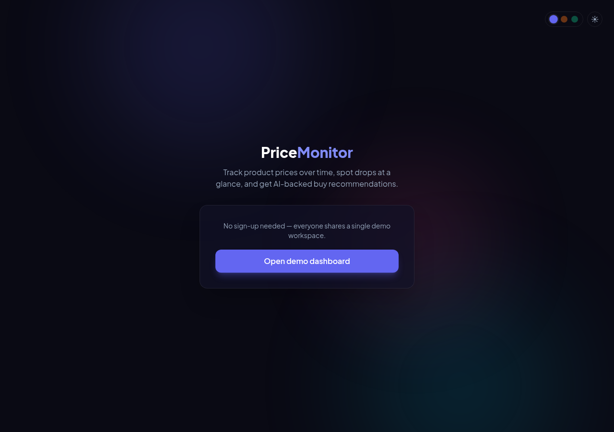
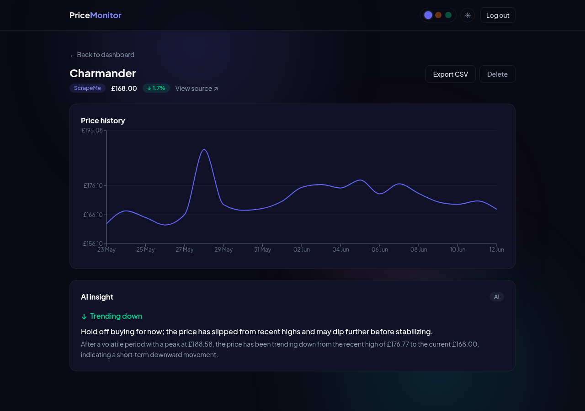

# Smart Price Monitor


[](https://price-monitor-bohdan.fly.dev)

**Live demo:** https://price-monitor-bohdan.fly.dev — one-click demo login, seeded with 5 products and 21 days of price history.

Tracks e-commerce product prices on a daily schedule, keeps the full price history, and turns it into a short AI trend read ("trending down — hold off buying") plus optional Telegram alerts when a price moves more than 5%.



## How it works

1. **Track a product** — paste a product URL from a supported store. The scraper pulls the current price and starts a history.
2. **Prices update daily** — a background scheduler re-scrapes every tracked product at 06:00 and appends a new history point. ("Scrape now" does it on demand.)
3. **Read the trend** — open a product to see its price chart and a one-line AI insight (trend direction + a buy/hold/wait recommendation). Export the history as CSV anytime.

| Login | Dashboard | Product detail |
|---|---|---|
|  |  |  |

## Features

- **Daily scheduled scraping** — APScheduler re-scrapes every active product at 06:00 and stores a new price point
- **Full price history** — every check is kept; the product page renders it as a Recharts line chart
- **AI trend insights** — Groq (`gpt-oss-120b`) summarizes the trend and gives a buy/hold/wait line; falls back to a deterministic heuristic when no key is set
- **Telegram alerts** — optional push notification when a price moves more than 5% (silently disabled if no bot token is configured)
- **Pluggable site adapters** — a small CSS-selector adapter registry; adding a new store is one entry (`books.toscrape.com` and `scrapeme.live` ship by default)
- **Demo controls** — "Scrape now" re-scrapes live, "Simulate change" jitters prices so you can watch the chart and alerts react during a demo
- **CSV export** — download a product's full price history
- **Demo auth** — one-click demo login issues a JWT; no sign-up needed
- **Dark/light theme** — three color schemes, persisted in localStorage
- **Production-ready** — Alembic migrations, Postgres-ready (SQLite by default), `/api/health`

## Tech stack

| Layer | Tech |
|---|---|
| Backend | FastAPI, SQLAlchemy 2 + Alembic (SQLite / PostgreSQL), PyJWT |
| Scraping | httpx + BeautifulSoup, APScheduler (daily cron) |
| AI | Groq — `openai/gpt-oss-120b`, with a heuristic fallback |
| Alerts | Telegram Bot API (optional) |
| Frontend | React 19, Vite, Tailwind CSS 4, Recharts, React Router |
| Tests | pytest (19 tests: scraper parsing on fixtures + API with mocked scraper/AI) |
| Deploy | Fly.io (single machine, SQLite on persistent volume) |

## Run locally

```bash
# backend
python -m venv .venv && source .venv/bin/activate
pip install -r requirements.txt
cp .env.example .env          # optional: add a free Groq key from https://console.groq.com
alembic upgrade head          # create the schema
python -m backend.seed_demo   # seed the demo workspace
uvicorn backend.main:app --port 8011

# frontend (dev mode, in another terminal)
cd frontend
npm install
npm run dev                   # http://localhost:5173, proxies /api to :8011
```

For a production-style run, build the SPA and let FastAPI serve it:

```bash
cd frontend && npm run build && cd ..
uvicorn backend.main:app --port 8011   # http://localhost:8011
```

Without a `GROQ_API_KEY` the app still works — insights come from the heuristic fallback. Without `TELEGRAM_BOT_TOKEN`, alerts are simply skipped.

## Tests

```bash
python -m pytest tests/
```

The scraper is tested against saved HTML fixtures, and the API tests mock the scraper and AI — no network, API key or tokens needed.

## API overview

| Method | Endpoint | Description |
|---|---|---|
| POST | `/api/auth/demo` | One-click demo login, returns a JWT |
| GET | `/api/health` | Service health |
| GET/POST | `/api/products` | List tracked products / start tracking a URL |
| DELETE | `/api/products/{id}` | Stop tracking a product |
| GET | `/api/products/{id}/history` | Full price history |
| GET | `/api/products/{id}/insight` | AI trend insight (trend + recommendation) |
| GET | `/api/products/{id}/export.csv` | Price history as CSV |
| POST | `/api/scrape` | Re-scrape all products now (`?jitter=true` simulates changes) |

## Deploy

Deployed on Fly.io (region `fra`, single shared-CPU machine, SQLite on a persistent volume). The container builds the React SPA, runs `alembic upgrade head`, seeds the demo workspace, and serves both API and SPA from one FastAPI process (`Dockerfile` + `start.sh` + `fly.toml`).

**Daily-cron caveat (honest note):** the Fly machine has `auto_stop_machines` enabled, so it sleeps when idle. The 06:00 daily scrape only fires if the machine happens to be awake at that time. For live demos this doesn't matter — "Scrape now" and "Simulate change" trigger scrapes on demand. For a genuinely reliable daily schedule, set `min_machines_running = 1` in `fly.toml` (or move the cron to an always-on worker).

`DATABASE_URL` switches the database (defaults to local SQLite). Schema is managed by Alembic: `alembic upgrade head`.
